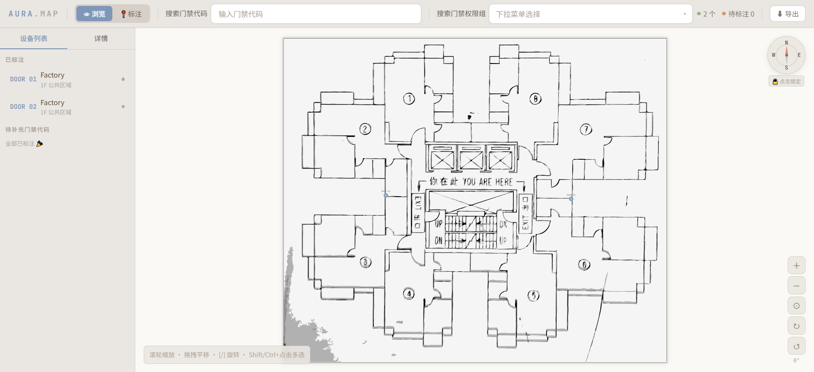
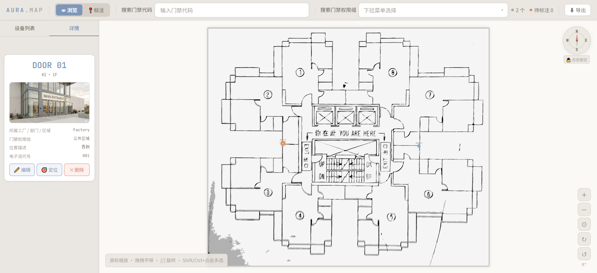
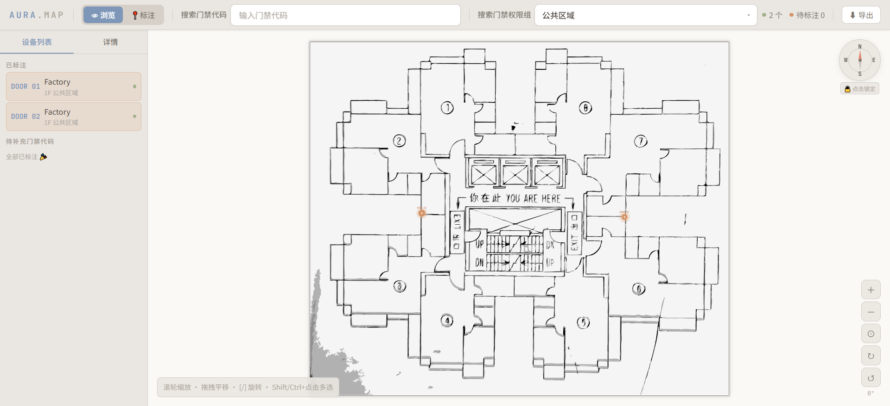
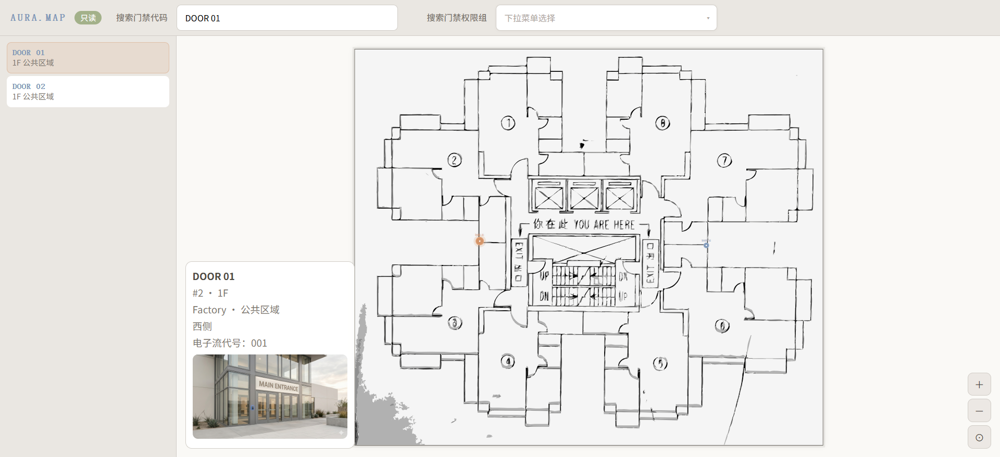

<a id="readme-top"></a>

<div align="center">

[![HTML][html-shield]][html-url]
[![JavaScript][js-shield]][js-url]
[![SVG][svg-shield]][svg-url]
[![AI协作][ai-shield]][ai-url]
[![GitHub Pages][pages-shield]][pages-url]

</div>

<br />
<div align="center">
  <h1>🗺️ AURA MAP</h1>
  <h3>工业门禁可视化管理系统</h3>
  <p>
    一款让工厂门禁信息「看得见、找得到、发得出」的轻量工具<br/>
    由业务人员主导 · AI 协作开发 · 零代码基础完成
  </p>
  <p>
    <a href="https://daidaimoon.github.io/AURA-MAP/"><strong>🌐 在线体验 Demo »</strong></a>
    &nbsp;·&nbsp;
    <a href="https://github.com/daidaimoon/AURA-MAP/issues">报告问题</a>
    &nbsp;·&nbsp;
    <a href="https://github.com/daidaimoon/AURA-MAP/issues">功能建议</a>
  </p>
</div>

---

<details>
  <summary>📋 目录</summary>
  <ol>
    <li><a href="#-项目背景">项目背景</a></li>
    <li><a href="#-功能预览">功能预览</a></li>
    <li><a href="#-核心功能">核心功能</a></li>
    <li><a href="#-技术栈">技术栈</a></li>
    <li><a href="#-快速开始">快速开始</a></li>
    <li><a href="#-设计亮点">设计亮点</a></li>
    <li><a href="#-未来规划">未来规划</a></li>
    <li><a href="#-关于这个项目">关于这个项目</a></li>
  </ol>
</details>

---

## 📖 项目背景

在制造业的日常工作中，我发现工厂门禁管理长期面临一个共同困境：

> **门禁点位在哪里？谁有权限进入？现场长什么样？**
> 这三个最基本的问题，往往要翻 Excel、对平面图、问同事才能回答。

传统方式的痛点：

- 📄 门禁信息存在 Excel 里，和平面图完全脱节
- 🔍 想找某个权限组的所有门禁，要一行行筛选
- 📸 现场照片散落在手机相册，无法与设备关联
- 📤 发给同事查阅，对方看不到最新数据

**AURA MAP** 就是为解决这些问题而生的——把 CAD 矢量平面图变成可交互的门禁数据库，让管理工作从「查表」变成「看图」。

<p align="right">(<a href="#readme-top">↑ 返回顶部</a>)</p>

---

## 🖼️ 功能预览

**主界面 · 浏览模式** — 矢量底图 + 门禁标记 + 设备列表，三栏联动



**详情面板** — 点击任意门禁标记，展开完整信息卡片与现场照片



**权限组筛选** — 选择权限组，地图与列表同步高亮所有匹配门禁



**只读导出版** — 一键导出含照片的独立 HTML，同事无需任何软件直接打开



<p align="right">(<a href="#readme-top">↑ 返回顶部</a>)</p>

---

## ✨ 核心功能

| 功能 | 说明 |
|------|------|
| 🗺️ **矢量底图渲染** | SVG 格式，无限缩放不失真，支持平移 / 旋转 / 缩放 |
| 📍 **精准标注** | 点击底图放置门禁标记，自动检测边界防止误触 |
| 👁 **浏览 / 标注双模式** | 浏览模式查看，标注模式编辑，互不干扰 |
| 🔍 **门禁代码搜索** | 输入即搜索，结果下拉展示，点击直接定位 |
| 🔎 **权限组批量筛选** | 下拉选择，地图与列表同步高亮 |
| 📸 **照片管理** | 每个门禁上传现场照片，IndexedDB 存储，支持 100 张以上 |
| 💬 **信息气泡** | 悬浮门禁弹出照片气泡，离开立即消失 |
| 📤 **只读版导出** | 导出含照片的独立 HTML，同事直接浏览无法编辑 |
| 📊 **CSV 导出** | 一键导出全字段结构化数据 |
| 🧭 **可编辑指南针** | 自定义方向标注，支持锁定 |
| ✅ **Ctrl/Shift 多选** | 支持批量选择门禁 |

**记录字段：** 门禁代码 · 所属工厂/区域/部门 · 楼层 · 门禁权限组 · 位置描述 · 电子流代号 · 现场照片

<p align="right">(<a href="#readme-top">↑ 返回顶部</a>)</p>

---

## 🛠️ 技术栈

本项目为**纯前端单文件应用**，零依赖，无需安装任何软件：

| 技术 | 用途 | 选择原因 |
|------|------|----------|
| **原生 HTML/CSS/JS** | 整体结构与交互 | 零依赖，任意浏览器直接打开 |
| **SVG** | 矢量底图渲染 | 无限缩放不失真，源自 CAD 导出 |
| **IndexedDB** | 照片持久化存储 | 支持 Blob 存储，解决 base64 溢出问题 |
| **localStorage** | 门禁基本信息 | 轻量即时，无感知保存 |

**开发方式：AI 协作编程（Vibe Coding）**

> 业务人员主导需求与产品决策，AI 负责代码实现，历经 **20+ 轮迭代**，从零原型到可用产品。

<p align="right">(<a href="#readme-top">↑ 返回顶部</a>)</p>

---

## 🚀 快速开始

无需安装任何软件，3 步上手：

**1. 下载文件**

点击页面右上角绿色 `Code` 按钮 → `Download ZIP` → 解压

**2. 打开网页**

用 **Chrome 或 Edge 浏览器**直接打开 `index.html`

**3. 开始使用**

```
① 点击顶部「📍 标注」切换到标注模式
② 在底图上点击，放置门禁标记
③ 填写门禁信息（代码、楼层、权限组等）
④ 上传现场照片
⑤ 点击「⬇ 导出」→「导出只读网页」分发给同事
```

> 💡 数据自动保存在浏览器本地，下次打开自动恢复

<p align="right">(<a href="#readme-top">↑ 返回顶部</a>)</p>

---

## 💡 设计亮点

**① 自定义门禁代码排序算法**

针对制造业常见的混合编码（如 `EA90 → EA91 → EA9A → EA9B → EAA1`），实现逐位比较排序：每一位数字（0-9）始终排在字母（A-Z）前面。这一细节来自真实业务需求，确保设备列表始终符合使用习惯。

**② 照片存储方案升级**

初版将照片以 base64 存入 localStorage，在 100 张照片的实际场景下必然溢出崩溃。经过方案评估，改用 **IndexedDB 存储原始 Blob**，理论容量提升至 GB 级，彻底解决大批量照片存储问题。

**③ 只读版嵌入式导出**

导出的只读 HTML 将矢量底图、门禁数据、照片**完整内嵌为单一文件**，无需服务器，同事收到直接用浏览器打开，所见即所得，且无法修改原始数据。

<p align="right">(<a href="#readme-top">↑ 返回顶部</a>)</p>

---

## 🗺️ 未来规划

- [ ] 接入内网后端服务，实现多设备数据共享
- [ ] 多工厂总览导航页（点击厂区跳转对应地图）
- [ ] 移动端自适应布局
- [ ] 门禁变更历史记录

<p align="right">(<a href="#readme-top">↑ 返回顶部</a>)</p>

---

## 🙋 关于这个项目

我在制造业从事行政/安保管理工作，长期被工厂门禁信息管理的低效困扰。  
这个项目是我第一次尝试用 AI 协作编程解决真实工作痛点的完整实践记录。

**我没有任何编程背景**，但我负责了全部的产品决策：

- 识别业务痛点，定义核心需求
- 设计数据结构与交互逻辑
- 主导 20+ 轮功能迭代与问题排查
- 做出关键技术方案决策（存储方案、导出方案等）

> 这个项目让我相信：**懂业务的人 + AI 工具 = 真正能用的产品。**

---

[![GitHub][github-shield]][github-url]

项目地址：[https://github.com/daidaimoon/AURA-MAP](https://github.com/daidaimoon/AURA-MAP)

<p align="right">(<a href="#readme-top">↑ 返回顶部</a>)</p>

---

<!-- 徽章链接 -->
[html-shield]: https://img.shields.io/badge/HTML-单文件应用-E34F26?style=for-the-badge&logo=html5&logoColor=white
[html-url]: https://github.com/daidaimoon/AURA-MAP
[js-shield]: https://img.shields.io/badge/JavaScript-原生无框架-F7DF1E?style=for-the-badge&logo=javascript&logoColor=black
[js-url]: https://github.com/daidaimoon/AURA-MAP
[svg-shield]: https://img.shields.io/badge/SVG-矢量底图-FFB13B?style=for-the-badge&logo=svg&logoColor=white
[svg-url]: https://github.com/daidaimoon/AURA-MAP
[ai-shield]: https://img.shields.io/badge/开发方式-AI协作编程-8A2BE2?style=for-the-badge&logo=anthropic&logoColor=white
[ai-url]: https://github.com/daidaimoon/AURA-MAP
[pages-shield]: https://img.shields.io/badge/部署-GitHub_Pages-222222?style=for-the-badge&logo=githubpages&logoColor=white
[pages-url]: https://daidaimoon.github.io/AURA-MAP/
[github-shield]: https://img.shields.io/badge/GitHub-daidaimoon-181717?style=for-the-badge&logo=github&logoColor=white
[github-url]: https://github.com/daidaimoon
